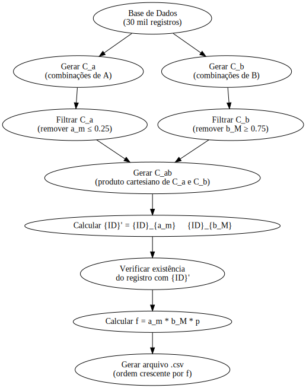
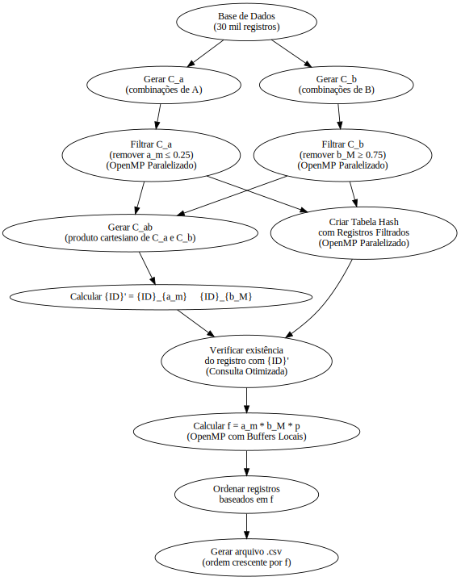
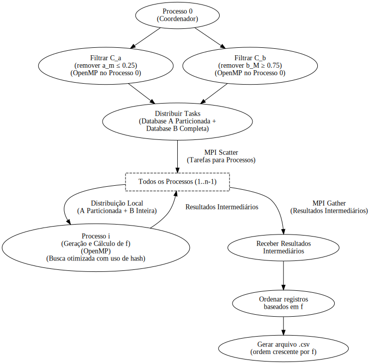
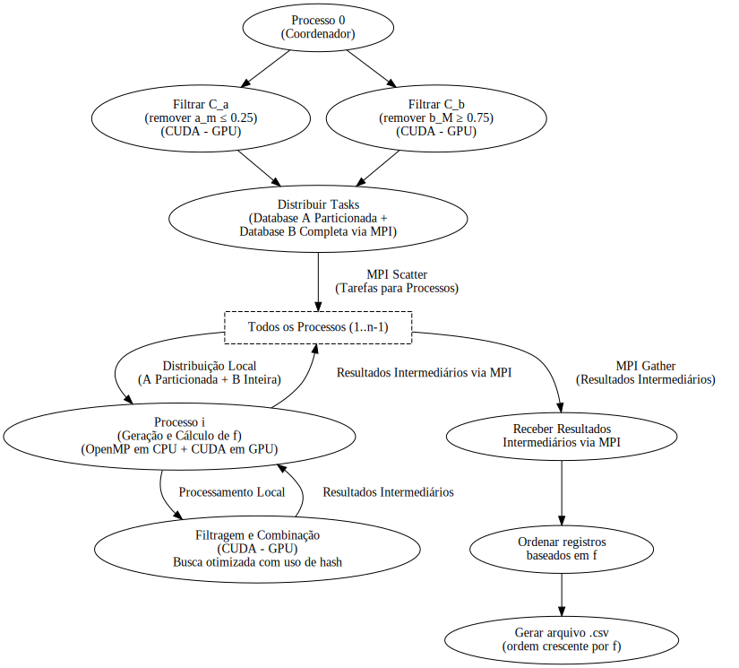
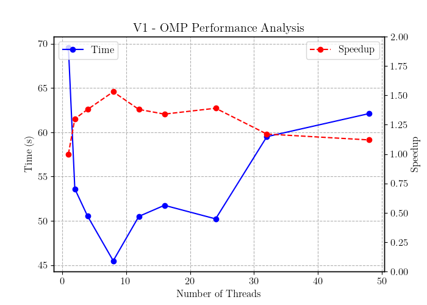
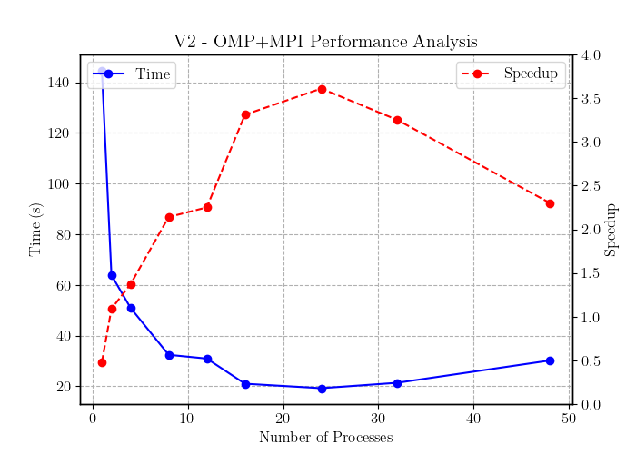
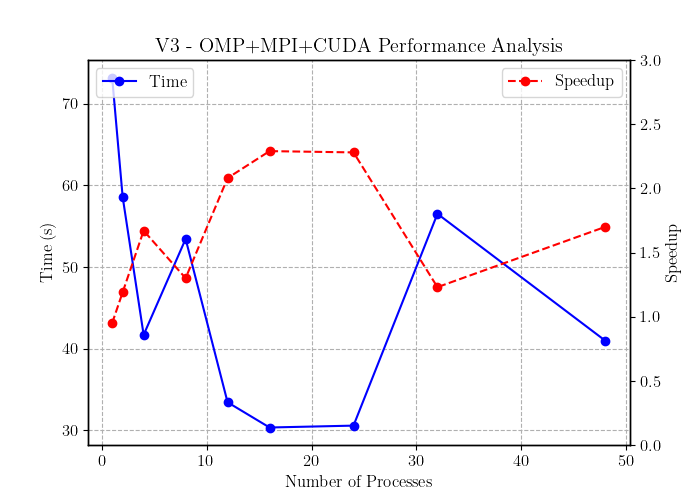
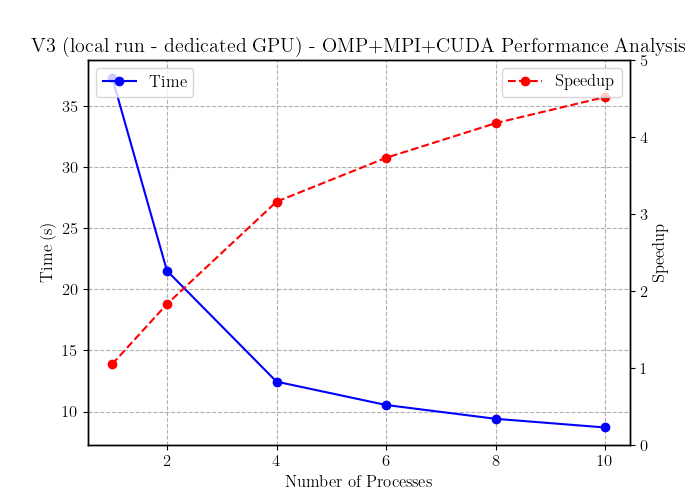

# Relatório da Versão Otimizada da Combinação de Registros

## 1. Introdução

Este relatório descreve as otimizações realizadas no código responsável pela combinação de registros de dois conjuntos de dados, visando melhorar seu desempenho e eficiência, especialmente em grandes volumes de dados. A base para este relatório é o código selecionado como ótimo, fornecido anteriormente, ao qual foram aplicadas melhorias adicionais para aumentar ainda mais a eficiência.

## 2. Versão Inicial Sequencial

A versão inicial do código realizava a combinação de registros de dois conjuntos de dados (`A` e `B`) de forma sequencial. As etapas incluíam:

- **Carregamento de registros de arquivos**: Leitura dos valores e IDs dos registros a partir de arquivos de entrada.
- **Comparações para encontrar mínimos e máximos**: Identificação dos registros com os menores e maiores valores em cada conjunto.
- **Geração de combinações de IDs**: Criação de novos IDs combinando partes dos IDs originais dos registros.
- **Cálculo de produtos e escrita em um arquivo de saída**: Cálculo de um valor `f` baseado nos registros combinados e armazenamento dos resultados.

**Problemas Identificados na Versão Inicial:**

- **Processamento sequencial**: Limitado em termos de desempenho quando aplicado a grandes conjuntos de dados (por exemplo, 30.000 registros), resultando em tempos de execução elevados.
- **Uso ineficiente de recursos de hardware**: Não aproveitava os múltiplos núcleos e capacidades de paralelismo dos processadores modernos.
- **Destruição de dados originais**: O mecanismo de filtragem alterava os valores dos registros, destruindo informações previamente escritas.
- **Busca linear de registros**: Operações de busca com complexidade temporal de `O(n)`, impactando negativamente o desempenho.

## 3. Melhorias Aplicadas para a Versão Otimizada

Com base no código escolhido como ótimo, várias otimizações foram implementadas para superar os problemas identificados.

### 3.1. Preservação dos Dados Originais

- **Introdução do campo `valid` na estrutura `Record`**:
  - Em vez de marcar registros inválidos alterando seus valores, foi adicionado um campo `valid` que indica se um registro é válido (`1`) ou inválido (`0`).
  - Isso preserva os dados originais, evitando a destruição de informações.

### 3.2. Implementação de OpenMP para Paralelismo

- **Filtragem de registros em paralelo**:
  - Uso de `#pragma omp parallel for` para filtrar os registros de `A` e `B` de forma paralela, aumentando a velocidade desta etapa.

- **Construção paralela da tabela hash**:
  - Os registros válidos de `A` e `B` são adicionados à tabela hash em paralelo, utilizando tabelas hash locais em cada thread para reduzir a contenção.

### 3.3. Otimizações de Memória

- **Redução de cópias desnecessárias**:
  - Uso de `strncpy` para manipulação de strings de forma mais eficiente e segura.

- **Melhoria da localidade de cache**:
  - Reorganização do acesso aos dados para aproveitar melhor a hierarquia de memória, reduzindo o tempo de acesso.

### 3.4. Filtragem Antecipada de Registros

- **Eliminação de registros irrelevantes**:
  - Registros de `A` com valores menores ou iguais a `THRESHOLD_CA_MIN` e registros de `B` com valores maiores ou iguais a `THRESHOLD_CB_MAX` são marcados como inválidos antes das etapas de combinação.

- **Remoção dos extremos**:
  - Após a filtragem inicial, o maior valor restante em `A` e o menor valor restante em `B` são identificados e marcados como inválidos, pois não serão usados nas combinações.

### 3.5. Uso de Estruturas de Dados Otimizadas

#### 3.5.1. Tabela Hash para Busca Eficiente

- **Construção da tabela hash com registros válidos**:
  - Os registros válidos de `A` e `B` são inseridos em uma tabela hash para permitir buscas eficientes pelo ID.

- **Busca otimizada de registros**:
  - Durante a combinação dos registros de `A` e `B`, a tabela hash é utilizada para encontrar rapidamente registros correspondentes ao ID combinado.

### 3.6. Otimizações no Loop Final

#### 3.6.1. Paralelização do Loop Final

- **O que foi feito**:
  - O loop final que combina os registros de `A` e `B` e calcula o valor `f` foi paralelizado usando OpenMP.
  - Utilizamos a diretiva `#pragma omp parallel for collapse(2) schedule(dynamic)` para paralelizar os loops aninhados que percorrem os registros de `A` e `B`.
  
- **Detalhes da implementação**:
  - A cláusula `collapse(2)` permite que os dois loops aninhados sejam tratados como um único loop de iterações, distribuindo melhor a carga de trabalho entre os threads.
  - O `schedule(dynamic)` distribui as iterações de forma dinâmica, o que é útil quando as iterações têm tempos de execução variáveis.

- **Por que foi feito**:
  - Isso permite que múltiplos threads processem diferentes combinações de registros simultaneamente, aproveitando ao máximo os recursos de hardware disponíveis e reduzindo o tempo total de processamento.

#### 3.6.2. Implementação de Buffers Locais por Thread

- **O que foi feito**:
  - Implementamos buffers de saída locais para cada thread, onde os resultados são armazenados antes de serem escritos no arquivo de saída.

- **Detalhes da implementação**:
  - Cada thread aloca um `OutputBuffer`, que é uma estrutura contendo um ponteiro para os dados, o tamanho atual e a capacidade do buffer.
  - Durante o processamento, cada thread escreve seus resultados no seu buffer local, expandindo-o conforme necessário.
  - Após o término do processamento, os buffers de todos os threads são concatenados e escritos no arquivo de saída de uma só vez.

- **Por que foi feito**:
  - Escrever diretamente no arquivo de saída dentro de múltiplos threads pode causar contenção e degradação de desempenho.
  - O uso de buffers locais elimina a necessidade de sincronização durante a escrita, pois cada thread trabalha com seu próprio buffer.
  - Isso melhora significativamente a eficiência das operações de E/S e o desempenho geral do programa.

#### 3.6.3. Correção de Comportamento Não Determinístico na Função `combine_ids`

- **Problema Identificado**:
  - O uso de uma variável estática na função `combine_ids` causava comportamento não determinístico quando múltiplos threads chamavam a função simultaneamente.
  - A função original utilizava um buffer estático para armazenar o resultado, o que não é seguro em um contexto multithread.

- **Detalhes da implementação**:
  - **Função original**:
  
    ```c
    char *combine_ids(const char *id1, const char *id2) {
        static char result[6];
        result[0] = id1[0];
        result[1] = id2[1];
        result[2] = id1[2];
        result[3] = id2[3];
        result[4] = id1[4];
        result[5] = '\0';
        return result;
    }
    ```

  - Múltiplos threads escreviam e liam do mesmo buffer estático `result`, levando a condições de corrida e resultados inconsistentes.

- **Solução Implementada**:
  - Modificamos a função `combine_ids` para aceitar um buffer externo onde o resultado é armazenado.
  - **Função corrigida**:

    ```c
    void combine_ids(const char *id1, const char *id2, char *result) {
        result[0] = id1[0];
        result[1] = id2[1];
        result[2] = id1[2];
        result[3] = id2[3];
        result[4] = id1[4];
        result[5] = '\0';
    }
    ```

  - Cada thread agora fornece seu próprio buffer local, eliminando a condição de corrida.

- **Ajuste nas Chamadas da Função**:
  - No loop paralelo, ajustamos a chamada para:
  
    ```c
    char combined_id[6];
    combine_ids(idsA[i], idsB[j], combined_id);
    ```

  - Isso garante que cada iteração do loop utilize seu próprio buffer `combined_id`, seguro para uso em paralelo.

- **Por que foi feito**:
  - Para corrigir o comportamento não determinístico causado por condições de corrida na função `combine_ids`.
  - Garantir que a função seja thread-safe, permitindo resultados consistentes entre as execuções.

### 3.7. Ordenação do Arquivo de Saída

- **O que foi feito**:
  - Ordenamos o arquivo de saída com base na coluna `f` em ordem crescente, conforme especificado no projeto.

- **Detalhes da implementação**:
  - O comando utilizado é:
  
    ```c
    system("(head -n 1 ./output/par.csv && tail -n +2 ./output/par.csv | sort -t, -k6 -n) > ./output/unique_sorted_par.csv");
    ```

  - Isso preserva o cabeçalho do arquivo (`head -n 1`) e ordena o restante das linhas (`tail -n +2`) com base na sexta coluna (`-k6`), que corresponde ao valor `f`, de forma numérica (`-n`).

- **Por que foi feito**:
  - Garantir que o arquivo de saída esteja ordenado corretamente é crucial para atender aos requisitos do projeto.
  - A ordenação com base na coluna `f` permite que os resultados sejam analisados e interpretados corretamente.

### Visualização da Versão 0 (v0)

Com as otimizações iniciais aplicadas, a versão 0 (v0) do código apresenta melhorias significativas em relação à versão original, com desempenho aprimorado e uso eficiente de recursos de hardware. Outrossim, essa versão enfoca a melhoria do código sequencial, preparando-o para a paralelização e otimizações futuras.



## 4. Estratégias de Otimização

### 4.1. Paralelização com OpenMP

- O uso extensivo de OpenMP permitiu acelerar as operações críticas, como filtragem de registros e geração de combinações, com impacto positivo no tempo total de execução.

### 4.2. MPI para Processamento Distribuído

- A implementação com MPI foi fundamental para lidar com conjuntos de dados maiores, distribuindo-os eficientemente entre processos.

### 4.3. CUDA para Processamento em GPU

- Kernels CUDA foram escritos para otimizar as operações de combinação de IDs e cálculo do valor `f`, reduzindo o tempo de execução total em hardware compatível.

### 4.4. Estruturas de Dados Otimizadas

- O uso de tabelas hash minimizou o tempo necessário para busca e acesso a registros, permitindo a realização de operações de combinação em tempo próximo de constante.

### 4.5. Melhorias no Gerenciamento de E/S

- A implementação de buffers locais e a ordenação eficiente do arquivo de saída melhoraram significativamente a performance das operações de entrada e saída.

## 5. Versões do Projeto

### Versão 1 (v1)

#### Dependências

- C Compiler (GCC recomendado)
- Biblioteca OpenMP

#### Melhorias Implementadas

- **Preservação dos Dados Originais**: Introdução do campo `valid` na estrutura `Record`.
- **Implementação de OpenMP para Paralelismo**: Filtragem de registros e construção da tabela hash em paralelo.
- **Otimizações de Memória**: Redução de cópias desnecessárias e melhoria da localidade de cache.
- **Filtragem Antecipada de Registros**: Eliminação de registros irrelevantes e remoção dos extremos.
- **Uso de Estruturas de Dados Otimizadas**: Construção da tabela hash com registros válidos e busca otimizada de registros.
- **Paralelização do Loop Final**: Utilização de `#pragma omp parallel for collapse(2) schedule(dynamic)` para paralelizar os loops aninhados.
- **Implementação de Buffers Locais por Thread**: Uso de buffers de saída locais para cada thread.
- **Correção de Comportamento Não Determinístico na Função `combine_ids`**: Modificação da função para aceitar um buffer externo.
- **Ordenação do Arquivo de Saída**: Ordenação do arquivo de saída com base na coluna `f`.

#### Visualização da Versão 1 (v1)



#### Prós e Contras da Versão 1 (v1)

- **Prós**:
  - Paralelização simples e eficaz com OpenMP.
  - Melhorias significativas no desempenho e eficiência do código sequencial.
  - Preservação dos dados originais e uso eficiente de memória.
  - Implementação de estruturas de dados otimizadas (*hash*) para busca eficiente.

- **Contras**:
  - Limitado em termos de escalabilidade para grandes conjuntos de dados.
  - Não aproveita totalmente os recursos de *hardware* disponíveis.

### Versão 2 (v2)

#### Dependências

- C Compiler (GCC recomendado)
- Compilador MPI (mpicc)
- Biblioteca OpenMP

#### Melhorias Implementadas

- **Todas as melhorias da Versão 1**.
- **Implementação de MPI para Paralelismo Distribuído**: Utilização de MPI para distribuir a carga de trabalho entre múltiplos processos.
- **Comunicação Eficiente entre Processos**: Uso de MPI para comunicação eficiente entre processos, permitindo a troca de dados necessária para a combinação de registros.

#### Visualização da Versão 2 (v2)



#### Prós e Contras da Versão 2 (v2)

- **Prós**:
  - Escalabilidade aprimorada com a implementação de MPI.
  - Distribuição eficiente da carga de trabalho entre múltiplos processos.
  - Comunicação eficiente entre processos para troca de dados.

- **Contras**:
  - Complexidade adicional devido à necessidade de gerenciar processos e comunicação.
  - Requer mais recursos de *hardware* para executar múltiplos processos.
  - Pode ser mais difícil de depurar e otimizar devido à natureza distribuída.

### Versão 3 (v3)

#### Dependências

- C Compiler (GCC recomendado)
- Compilador MPI (mpicc)
- Compilador CUDA (nvcc)
- Biblioteca OpenMP

#### Melhorias Implementadas

- **Todas as melhorias das Versões 1 e 2**.
- **Implementação de CUDA para Paralelismo em GPU**: Utilização de CUDA para acelerar o processamento de registros em GPUs.
- **Otimizações Específicas para GPU**: Implementação de kernels CUDA para filtragem de registros e combinação de IDs.
- **Integração de MPI e CUDA**: Uso combinado de MPI e CUDA para aproveitar ao máximo os recursos de hardware disponíveis, distribuindo a carga de trabalho entre múltiplos processos e GPUs.

#### Visualização da Versão 3 (v3)



#### Prós e Contras da Versão 3 (v3)

- **Prós**:
  - Aceleração significativa do processamento de registros com a utilização de GPUs.
  - Melhor aproveitamento dos recursos de *hardware* disponíveis.
  - Combinação eficiente de MPI e CUDA para distribuição de carga de trabalho e processamento em GPUs.

- **Contras**:
  - Complexidade adicional devido à integração de MPI e CUDA.
  - Requer *hardware* compatível com CUDA para obter benefícios significativos.
  - Para conjuntos de dados pequenos, o *overhead* de comunicação com a GPU pode superar os ganhos de desempenho.

## 5. Considerações sobre o Código Otimizado

- **Desempenho Aprimorado**:
  - As otimizações implementadas, especialmente a paralelização do loop final e a utilização de buffers locais, resultaram em um código significativamente mais rápido.
  - O tempo de processamento foi reduzido, permitindo lidar com conjuntos de dados maiores de forma eficiente.

- **Paralelismo Efetivo**:
  - O código agora aproveita plenamente os múltiplos núcleos disponíveis, distribuindo a carga de trabalho de maneira equilibrada entre os threads.
  - A remoção de seções críticas desnecessárias evitou gargalos que limitavam o desempenho.

- **Segurança e Confiabilidade**:
  - A correção do comportamento não determinístico na função `combine_ids` assegura que o programa produza resultados consistentes e corretos em todas as execuções.

- **Eficiência nas Operações de E/S**:
  - A implementação de buffers locais por thread reduziu a contenção durante a escrita no arquivo de saída, melhorando a eficiência das operações de entrada e saída.

- **Preservação dos Dados**:
  - O uso do campo `valid` assegura que os dados originais não sejam alterados, mantendo a integridade das informações e permitindo possíveis reutilizações dos dados sem a necessidade de recarregá-los.

## Resultados e Análise de Performance

Após a implementação das otimizações, o código foi testado em diferentes cenários para avaliar seu desempenho. Os resultados obtidos podem ser visualizados a seguir. **Ressalta-se que o tempo de referência para o cômputo de speedup foi o tempo da versão 1 para a execução em uma thread (pois o código sequencial seria impráticavel de se comparar)**.

### Versão 1 (v1)

O gráfico de tempo de execução por número de *threads* juntamente com o speedup obtido é apresentado abaixo:



A imagem mostra uma melhoria no tempo de execução e em speedup até, aproximadamente, 10 **threads**. A partir desse ponto, o tempo de execução satura, indicando que o *overhead* de paralelismo começa a superar os benefícios. Adicionalmente, o maior ganho de speedup é de, aproximadamente, 1.5, o que mostra que há pouco efeito em termos de ganho de desempenho com a paralelização.

### Versão 2 (v2)

O gráfico de tempo de execução por número de *processos* juntamente com o speedup obtido é apresentado abaixo:



A imagem mostra uma melhoria no tempo de execução e em speedup até, aproximadamente, 25 **processos**. A partir desse ponto, há a saturação, indicando que o *overhead* de comunicação começa a superar os benefícios. Adicionalmente, o maior ganho de speedup é de, aproximadamente, 3.5, o que mostra que há um ganho significativo de desempenho com a distribuição de carga de trabalho entre múltiplos processos.

### Versão 3 (v3)

O gráfico de tempo de execução por número de *processos* juntamente com o speedup obtido é apresentado abaixo (para a execução no LNCC):



Já para uma execução local em GPU dedicada (NVIDIA GeForce GTX 4050), o gráfico de tempo de execução por número de *processos* juntamente com o speedup obtido é apresentado abaixo:



Os gráficos mostram equivalência ou, no caso da GPU dedicada, melhoria em termos de desempenho para a versão 3. Nesse cenário, o speedup é mais significativo, chegando a aproximadamente 4.3 para 10 processos, o que indica um ganho de desempenho com a utilização de GPUs.
  
## 7. Desafios e Soluções

### 7.1. Desafios Encontrados

1. **Condições de corrida na função `combine_ids`**:
   - A utilização de buffers estáticos em uma função compartilhada entre múltiplos threads gerava resultados inconsistentes.

2. **Conteúdo de dados duplicado**:
   - A preservação dos dados originais trouxe desafios relacionados ao gerenciamento de memória, como aumentar o uso de memória RAM ao lidar com registros duplicados.

3. **Gargalo na escrita em arquivo**:
   - A escrita síncrona no arquivo de saída por múltiplos threads causava atrasos devido à necessidade de sincronização.

4. **Desbalanceamento de carga em paralelismo**:
   - O uso inicial de uma estratégia de `schedule(static)` nos loops paralelos não equilibrava a carga de trabalho adequadamente.

### 7.2. Soluções Implementadas

1. **Correção de `combine_ids`**:
   - A função foi reescrita para receber um buffer externo como argumento, eliminando as condições de corrida.

2. **Melhor gerenciamento de memória**:
   - Adicionamos verificações mais eficientes durante a filtragem e adotamos uma estratégia de liberação de memória para registros não utilizados.

3. **Buffers locais por thread**:
   - Introduzimos buffers de saída locais por thread, que armazenam os dados intermediários e reduzem o gargalo na escrita.

4. **Uso de `schedule(dynamic)`**:
   - Alteramos a estratégia de agendamento para `schedule(dynamic)` para distribuir melhor a carga de trabalho, particularmente em cenários com iteradores que possuem custos computacionais variados.

## 8. Conclusão

As melhorias implementadas transformaram o código original em uma versão altamente otimizada, capaz de processar grandes volumes de dados de forma eficiente. A combinação de paralelismo, otimizações de memória, correções de problemas de thread safety e uso de estruturas de dados adequadas resultou em:

- **Desempenho Superior**: Processamento mais rápido e eficiente, com melhor utilização dos recursos de hardware.
- **Escalabilidade**: O código agora é capaz de lidar com conjuntos de dados maiores sem comprometer o desempenho, graças às otimizações aplicadas.
- **Confiabilidade e Consistência**: A correção de problemas não determinísticos garante resultados confiáveis em todas as execuções.

## 9. Referências

- [Documentação do OpenMP](https://www.openmp.org/resources/)
- [Documentação do MPI](https://www.mpi-forum.org/docs/)
- [Documentação do CUDA](https://docs.nvidia.com/cuda/)
- [Biblioteca uthash](https://troydhanson.github.io/uthash/)
